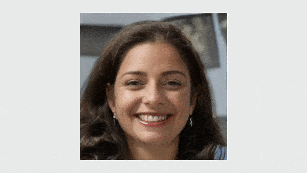

# GAN-Control: Explicitly Controllable GANs


<!---->


This is a pyTorch implementation of the following paper:

**GAN-Control: Explicitly Controllable GANs**, ICCV 2021, [[paper]](https://arxiv.org/abs/2101.02477) [[project page]](https://alonshoshan10.github.io/gan_control/).

Alon Shoshan, Nadav Bhonker, Igor Kviatkovsky and Gerard Medioni.


**Abstract:**<br>
We present a framework for training GANs with explicit control over generated facial images.
We are able to control the generated image by settings exact attributes such as age, pose, expression, etc.
Most approaches for manipulating GAN-generated images achieve partial control by leveraging the latent space disentanglement properties, obtained implicitly after standard GAN training. 
Such methods are able to change the relative intensity of certain attributes, but not explicitly set their values.
Recently proposed methods, designed for explicit control over human faces, harness morphable 3D face models (3DMM) to allow fine-grained control capabilities in GANs.
Unlike these methods, our control is not constrained to 3DMM parameters and is extendable beyond the domain of human faces.
Using contrastive learning, we obtain GANs with an explicitly disentangled latent space.
This disentanglement is utilized to train control-encoders mapping human-interpretable inputs to suitable latent vectors, thus allowing explicit control.
In the domain of human faces we demonstrate control over identity, age, pose, expression, hair color and illumination.
We also demonstrate control capabilities of our framework in the domains of painted portraits and dog image generation.
We demonstrate that our approach achieves state-of-the-art performance both qualitatively and quantitatively.

<br>

**Explicitly controlling face attributes as illumination, pose, expression, hair color and age:**
<center></center>

**Explicitly controlling painting attributes as pose, expression, and age:**
<center></center>

**Changing the artistic style of paintings while maintaining all other attributes:**
<center></center>

**Explicitly controlling the pose of generated images of dogs:**
<center></center>


## Training
The training process consists of phases:
1. Training a disentangled GAN.
2. Training control/attribute encoders:
   1. Constructing a {control/attribute : w latent} dataset. 
   2. Training control encoders.
    
### Phase 1: Training a disentangled GAN
1. Use one of the configs in `src/gan_control/configs`: `ffhq.json` for faces, `metfaces.json` for paintings and `afhq.json` for dogs.
2. In the config, edit `data_config.path` to point to your dataset directory.
3. Prepare the pretrained predictors (see: Prepare pretrained predictors) and save them in `src/gan_control/pretrained_models`. 
4. Download the [inception statistics](https://drive.google.com/drive/folders/1m8pUGjPUHCvQh_Gby4z8Yu7Hn9RTn0qb?usp=sharing) (for FID calculations) and save them in `src/gan_control/inception_stat`.
5. Run `python src/gan_control/train_generator.py --config_path <your config>`.

Training results will be saved in `<results_dir (given in the config file)>/<save_name (given in the config file)>_<some hyper parms>_<time>`.
This phase was trained on 4 Nvidia V100 GPUs with a batch size of 16 (batch of 4 per GPU). 

### Phase 2: Training control/attribute encoders
#### Constructing a {control/attribute : w latent} dataset
Run `python src/gan_control/make_attributes_df.py --model_dir <path to the GAN directory from phase 1> --save_path <dir where the dataset will be saved>/<dataset name>.pkl`.

Dataset will be saved in a form of a Dataframe in `save_path`.

#### Training control encoders
For each attribute you want to control:
1. Edit the corresponding config from `src/gan_control/configs/controller_configs`. 
   1. In: `generator_dir` write the path to your GAN directory from phase 1. 
   2. In: `sampled_df_path` write the path to the {control/attribute : w latent} dataset (path to Dataframe).
2. Run: `python src/gan_control/train_controller.py --config_path <your config from 1>`.

Your GAN will be saved in `<"results_dir" in config>/<"save_name" in config>`.
This phase was trained on 1 Nvidia V100 GPU with a batch size of 128.

### Faster training using custom CUDA kernels
For faster training, you can follow [Rosinality: StyleGAN 2 in PyTorch](https://github.com/rosinality/stylegan2-pytorch) and add custom CUDA kernels, similar to [here](https://github.com/rosinality/stylegan2-pytorch/blob/master/model.py#:~:text=from%20op%20import%20fusedleakyrelu%2C%20fused_leaky_relu%2C%20upfirdn2d%2C%20conv2d_gradfix), to line 18 in `gan_model.py` and set `FUSED = True` in line 15.  

### Datasets
This work supports the following datasets:
1. [FFHQ](https://github.com/NVlabs/ffhq-dataset)
2. [MetFaces](https://github.com/NVlabs/metfaces-dataset)
3. [AFHQ](https://github.com/clovaai/stargan-v2)

### Prepare pretrained predictors
Following are instructions to download and prepare the predictors used for running our code:
1. ArcFace (ID): Download `model_ir_se50.pth` from [InsightFace_Pytorch](https://github.com/TreB1eN/InsightFace_Pytorch#:~:text=IR-SE50%20%40%20BaiduNetdisk%2C-,ir-se50%20%40%20onedrive).
2. Hopenet (Pose): Download `hopenet_robust_alpha1.pkl` from [deep-head-pose](https://github.com/natanielruiz/deep-head-pose#:~:text=300w-lp%2C%20alpha%201%2C%20robust%20to%20image%20quality).
3. ESR (Expression): Download the directory named `esr_9` from [Efficient Facial Feature Learning](https://github.com/siqueira-hc/Efficient-Facial-Feature-Learning-with-Wide-Ensemble-based-Convolutional-Neural-Networks/tree/master/model/ml/trained_models/esr_9) and save it as is in `src/gan_control/pretrained_models`.
4. R-Net (Illumination): Download the pytorch R-Net model from [here](https://drive.google.com/drive/folders/1KUWGUQOLbhKCUBtbqfD3-xXFGnKsbMAR?usp=sharing). This model is converted to pytorch from the tensorflow model published by [Deep3DFaceReconstruction](https://github.com/microsoft/Deep3DFaceReconstruction).
5. PSPNet (Hair segmentation for hair color): Download `pspnet_resnet101_sgd_lr_0.002_epoch_100_test_iou_0.918.pth` from [pytorch-hair-segmentation](https://github.com/YBIGTA/pytorch-hair-segmentation#:~:text=Checkpoint-,pspnet_resnet101,-0.92).
6. DogFaceNet (Dog ID): Download the pytorch DogFaceNet model from [here](https://drive.google.com/drive/folders/1KUWGUQOLbhKCUBtbqfD3-xXFGnKsbMAR?usp=sharing). This model is converted to pytorch from the tensorflow model published by [DogFaceNet](https://github.com/GuillaumeMougeot/DogFaceNet).
7. DEX (Age):
   1. Download the caffe `dex_imdb_wiki.caffemodel` model from [IMDB-WIKI](https://data.vision.ee.ethz.ch/cvl/rrothe/imdb-wiki/#:~:text=real%20age%20estimation%20trained%20on%20imdb-wiki).
   2. Convert the model to pytorch. You can use this [converter](https://github.com/vadimkantorov/caffemodel2pytorch). 

## Inference
Download the [trained GAN](https://drive.google.com/file/d/19v0lX69fV6zQv2HbbYUVr9gZ8ZKvUzHq/view?usp=sharing) and save it in `resources/gan_models`.

Examples on how to explicitly and implicitly control the GAN's generation can be found in `notebooks/gan_control_inference_example.ipynb`.

Examples include:
1. Explicitly controlling pose.
2. Explicitly controlling age.
3. Explicitly controlling hair color.
4. Explicitly controlling illumination.
5. Explicitly controlling expression.
6. Accessing and implicitly modifying the GAN's latent space.

Examples for projecting images to latent space can be found in `notebooks/projection_example.ipynb`.

## Citation
Please consider citing our work if you find it useful for your research:
```
@InProceedings{Shoshan_2021_ICCV,
    author    = {Shoshan, Alon and Bhonker, Nadav and Kviatkovsky, Igor and Medioni, G\'erard},
    title     = {GAN-Control: Explicitly Controllable GANs},
    booktitle = {Proceedings of the IEEE/CVF International Conference on Computer Vision (ICCV)},
    month     = {October},
    year      = {2021},
}
```

## Acknowledgments
This code is heavily borrowed from [Rosinality: StyleGAN 2 in PyTorch](https://github.com/rosinality/stylegan2-pytorch).

This code uses the following models:
1. ArcFace (ID): [InsightFace_Pytorch](https://github.com/TreB1eN/InsightFace_Pytorch)
2. Hopenet (Pose): [deep-head-pose](https://github.com/natanielruiz/deep-head-pose)
3. ESR (Expression): [Efficient Facial Feature Learning](https://github.com/siqueira-hc/Efficient-Facial-Feature-Learning-with-Wide-Ensemble-based-Convolutional-Neural-Networks)
4. R-Net (Illumination): [Deep3DFaceReconstruction](https://github.com/microsoft/Deep3DFaceReconstruction)
5. DEX (Age): [IMDB-WIKI](https://data.vision.ee.ethz.ch/cvl/rrothe/imdb-wiki/)
6. PSPNet (Hair segmentation for hair color): [pytorch-hair-segmentation](https://github.com/YBIGTA/pytorch-hair-segmentation)
7. DogFaceNet (Dog ID): [DogFaceNet](https://github.com/GuillaumeMougeot/DogFaceNet)

This code uses [face-alignment](https://github.com/1adrianb/face-alignment) for face alignment.

## Security

See [CONTRIBUTING](CONTRIBUTING.md#security-issue-notifications) for more information.

## License

This project is licensed under the Apache-2.0 License.

